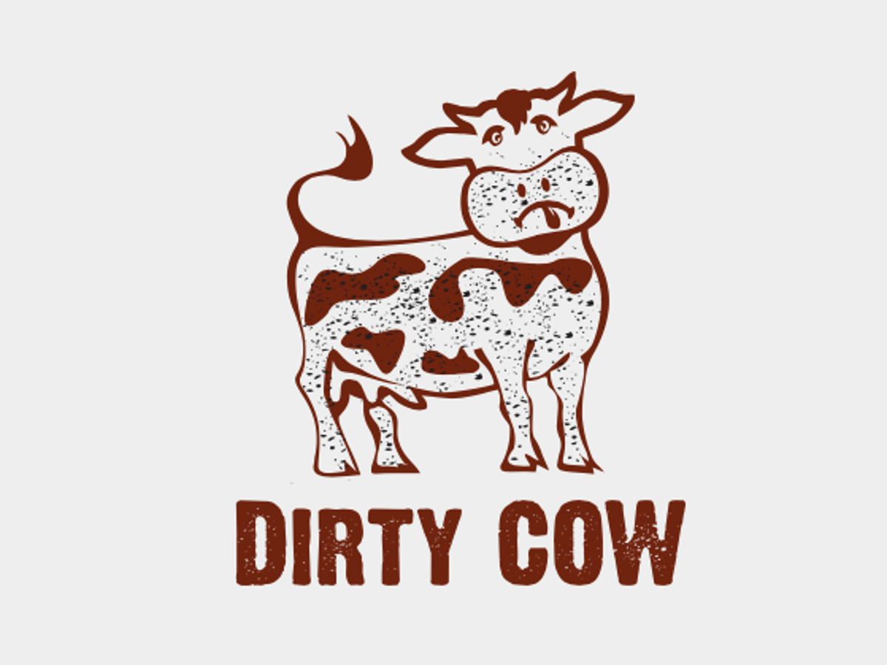
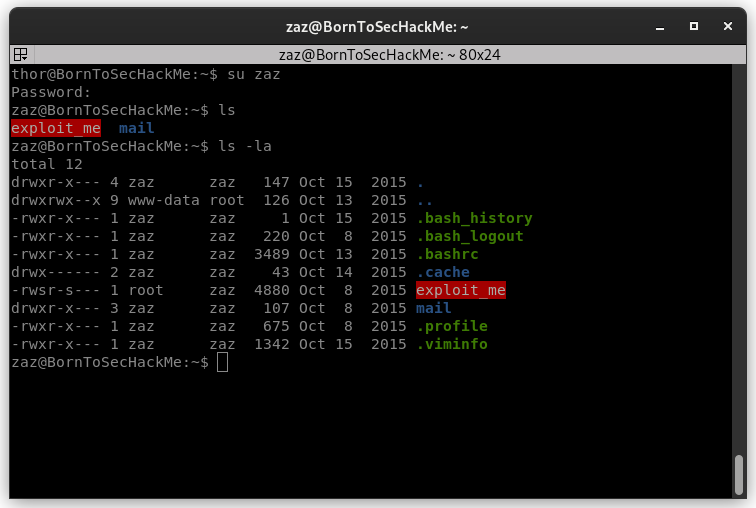
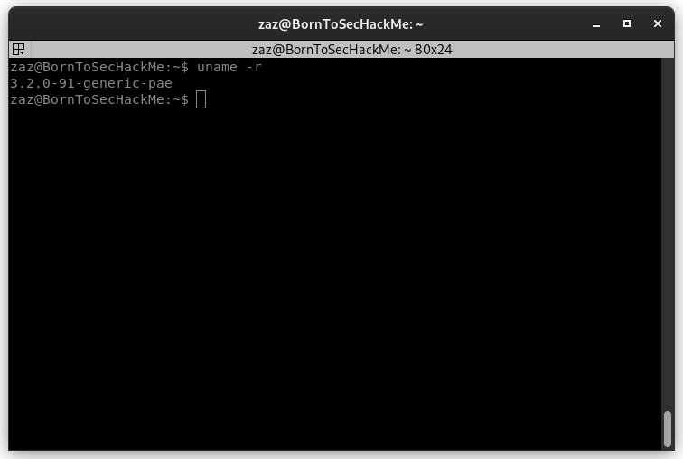
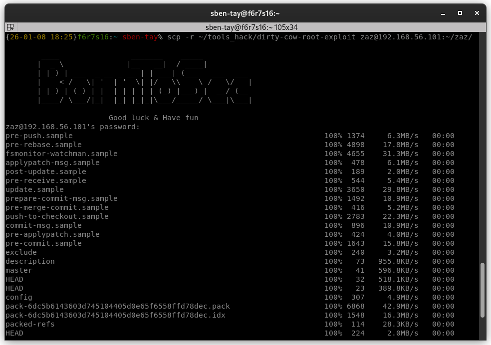
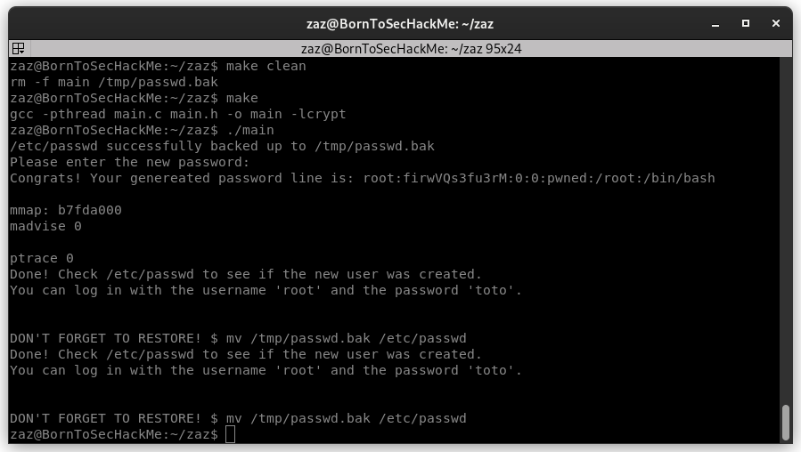
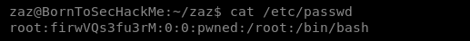
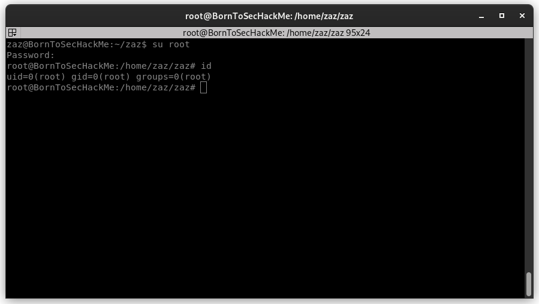

<div align="center">
  
</div>

# Boot2Root

**name:** writeup2
**Date:** 6th January 2026  
**Prepared By:** sben-tay's group
**Target identified:** 192.168.56.101
**source:** https://dirtycow.ninja/



---


> _For this exploit we need to complete [writeup1](./writeup1.md)_

## Enumeration

### SSH - Zaz


First step we need to connect ssh with user zaz.

- **login**    : `zaz`
- **password** : `646da671ca01bb5d84dbb5fb2238dc8e`

```bash
ssh zaz@192.168.56.101
```


### Dirty-CoW



Versions 2.6 through 3.2 of the Linux kernel have a vulnerability based on a race condition called Dirty-CoW. It is so named because this flaw is based on the exploitation of Copy-On-Write (C-o-W).

It allows any file on the system (/etc/shadow, SUID binaries, etc.) to be modified without the usual necessary permissions.

So we go to in [github Page](https://github.com/artemgurzhii/dirty-cow-root-exploit) to download the exploit. And we send the source code to the machine using the SCP command.

### Transfert exploit Dirty-Cow on VM


Maintenant que nous avons le logiciel d'exploitation nous avons plus qu'a l'executer !

Il nous demande un mot de passe, et nous informe que la ligne

``root:firwVQs3fu3rM:0:0:pwned:/root:/bin/bash``

a été rajouté au fichier /etc/passwd et qui nous pouvons a présent se connecter au user firefart avec le mdp toto.





Maintenant on va se connecter en avec l'user firefart.

- **login**    : `root`
- **password** : `toto`

Essayons de nous connecter



**Congratulation you're root !**

# END