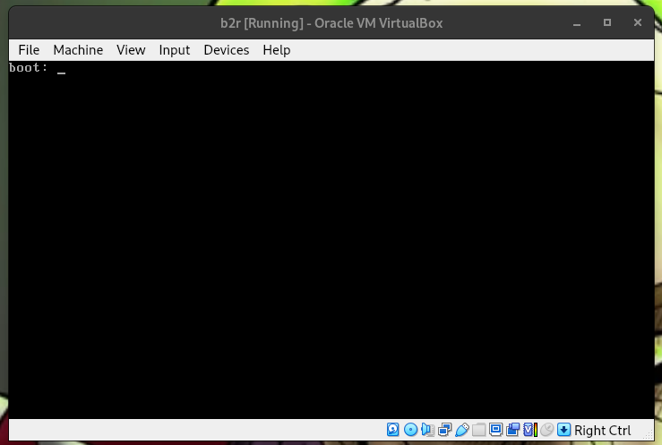
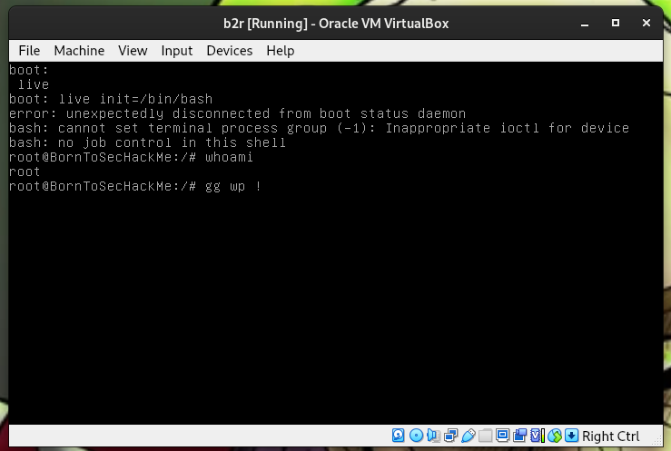

<div align="center">
  
</div>

# Boot2Root

**Date:** 6th January 2026  
**Prepared By:** sben-tay's group

---
# Root via GRUB – Writeup 4

At system startup, if you keep **SHIFT** pressed, you will reach the GRUB menu. **GRUB** is the system that runs before any services are started, such as password authentication.


We then instruct the system to launch the first process directly as **bash**, before any verification, by using the following command :
```init=/bin/bash```

